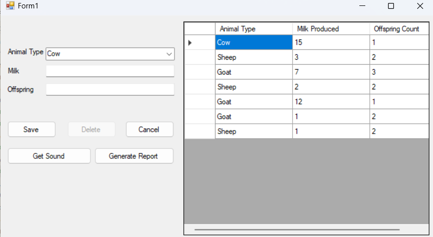

# Farm Winform

## Image capture


## Setup and Run
1. Clone the repository

```bash
git clone
```

2. Create a new database in SQL Server Management Studio

3. Run the script in the `SQLCreate.sql` file to create the tables

2. Open the project in Visual Studio

4. Update the ADO.Net Entity Data Model in the project to connect to the database

5. Update the connection string in the `App.config` file

6. Run the project


3. Run the project